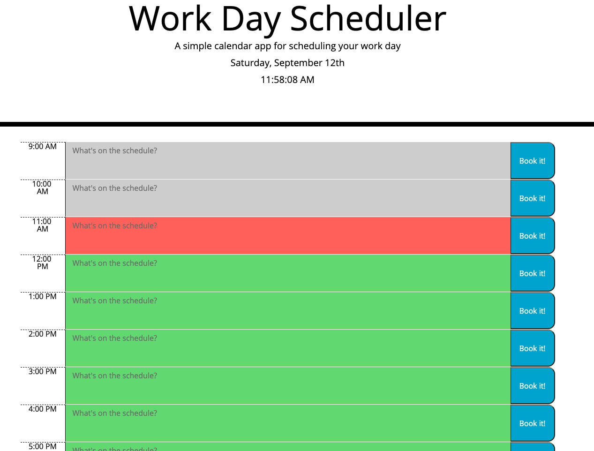
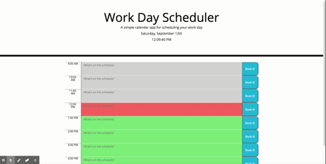

# calendar-application
For this project, we were tasked to construct a simple day planner which dynamically changed styling based on the current time, and allowed you to save entries to local storage. It was important to understand jQuery selectors and DOM manipulation to successfully complete it.

You will notice when comparing to my Code Quiz project, that I spend some time understanding how to make my code more dry and to more effectively render content dynamically on the page. Additionally, in order to effectively track time, we were tasked with incorporating [MomentJS](https://momentjs.com/). 

Overall, this project went smoothly from a styling standpoint and allowed me to gain practice with setting and getting data from local storage. Please see our User Story and Acceptance Criteria below. 

## User Story & Acceptance Criteria
```
GIVEN I am using a daily planner to create a schedule
WHEN I open the planner
THEN the current day is displayed at the top of the calendar
WHEN I scroll down
THEN I am presented with timeblocks for standard business hours
WHEN I view the timeblocks for that day
THEN each timeblock is color coded to indicate whether it is in the past, present, or future
WHEN I click into a timeblock
THEN I can enter an event
WHEN I click the save button for that timeblock
THEN the text for that event is saved in local storage
WHEN I refresh the page
THEN the saved events persist
```

The following animation demonstrates the application functionality:


## Challenges 
This homework was fairly streamline, but presented interesting challenges in regard to local storage and using new libraries. 

By implementing Moment.js into my code I was able to assign meaningful time data values to my time slots, date and clock as seen in the image of my page below. While the functionality is not included in the project you see here, this might allow for future refactoring to include intelligent notifications alerting the user the exact time until future events that they have booked on their calendar.


### Picture of working Web Page

#### Screenshot of Webpage



#### Demo of working Webpage


## Credits

I worked on this project with the collaboration of fellow students of the Georgia Tech Coding Boot Camp.

Additionally, I referenced sites such as:

* [W3Schools](https://www.w3schools.com/)
* [MDN](https://developer.mozilla.org/)
* [Momentjs](https://momentjs.com)


## Links

#### Page Link
https://ad-fleming.github.io/calendar-application/.
#### Repository 
https://github.com/ad-fleming/calendar-application